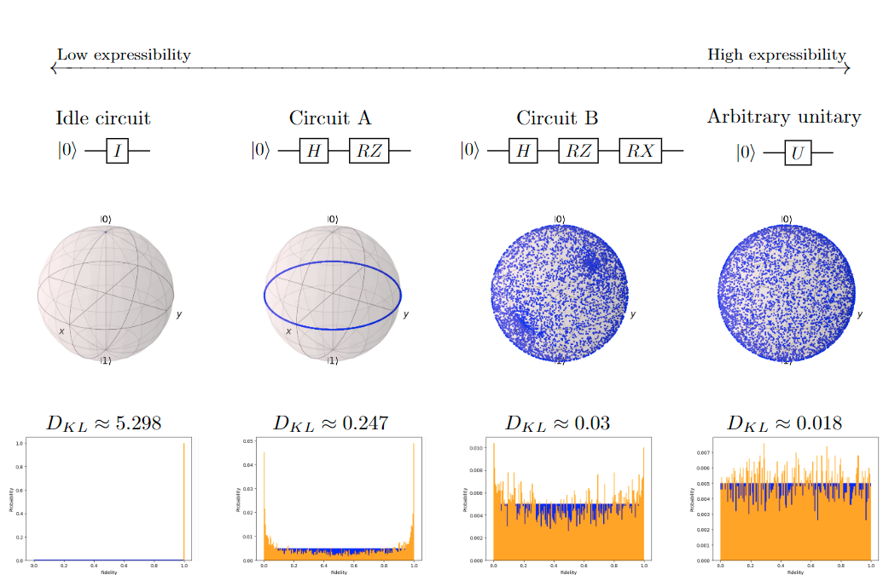

# About the project

Quantum Machine Learning (QML) is an exciting fusion of two disciplines, wherein classical machine learning techniques are augmented by quantum computation. Central to QML is the utilization of quantum bits, exploiting quantum mechanical principles such as superposition and entanglement to process vast amounts of information in parallel. This code is part of a thesis that focuses on quantum parameterized circuits, where gates with modifiable parameters facilitates the exploration of quantum states. Through the adjustment of these parameters, we can fine-tune the circuit’s behavior to execute computational tasks, including regression, classification and optimization. Nevertheless, there exists a gap in comprehension regarding the factors that render a specific parameterized circuit more potent or advantageous compared to others.

## Framework for quantum machine learning

To investigate these questions, we propose three descriptors for quantifying the expressibility and entanglement capabilities of parameterized quantum circuits. These quantities are computed using statistical properties based on sampling states from a circuit model family. For this thesis, a Python framework for quantum machine learning was developed. The provided code facilitates the sampling, training, and evaluation of quantum circuits, as well as implementation of the descriptors. Utilizing this framework, a total of 10,000 randomly selected quantum circuits was trained and scored on a classification task of the popular Iris dataset. Subsequently, a correlation analysis was conducted to explore the relationship between calculated descriptor values and the obtained scores.

## Descriptors

### Deviation from Haar distribution

Kouhei Nakaji and Naoki Yamamoto, building on work by Sukin Sim, Peter D. Johnson, and Al´an Aspuru-Guzik, suggests a descriptor A(t) (C) of the expressibility of a circuit C. It should be seen as the deviation of the state distribution generated by C from the Haar distribution:

$$
A^{(t)}(C)= \left \lVert \int_{Haar}^{} (\ket{\psi}\bra{\psi})^{\otimes t}d\psi - \int_{\Theta}^{} (\ket{\phi}\bra{\phi})^{\otimes t}d\theta \right \rVert_{HS}
$$

The Hilbert Schmidt distance is computed between to terms. The first term is the integral over the state $\ket{\psi}$ distributed with respect to the Haar measure. The second term is taken over all states over the measure induced by uniformly sampling parameters of the circuit $\theta \in \Theta$.

The definition implies that circuits with low $\mathcal{A}^{(t)}(C)$ has high expressibility. As $\mathcal{A}^{(t)}(C)$ approached zero, the states generated from C are almost equally distributed.

### Kullback–Leibler divergence

To estimate the probability distribution of fidelity for a circuit, we can randomly sample parameters $\theta \in \Theta$ and $\phi \in \Phi$ to obtain pairs of parameterized states. We will denote the probability distribution of fidelity $F$ for a circuit $C$ as $P(C, F)$. 

The probability distribution $P_{Haar}(F)$ could be sampled in a similar manner, using fidelities $F = |\braket{\psi|\psi'}|^2$, where $\ket{\psi}$ and $\ket{\psi'}$ are sampled according to the Haar measure. However, the analytical form of the probability density function of fidelities for a Haar random state is known. For fidelity $F$ and a Hilbert space of dimension $N$, the function is given by:

$$
    P_{Haar}(F) = (N - 1)(1 - F)^{N-2}
$$

For a comparison of the two distributions we use Kullback–Leibler (KL) divergence. For the distributions $P(C, F)$ and $P_{Haar}(F)$, we obtain an expression $\mathcal{E} (C)$ for the expressibility of a circuit $C$:

$$
\mathcal{E} (C) = D_{KL} (P(C, F) \parallel P_{Haar}(F)) = \int_{0}^{1} P(C, F) \, log \frac{P(C, F)}{P_{Haar}(F)} \,dF
$$

The following figure shows some single qubit example circuits of increasing expressebility, going from left to right. Note that fixed gates circuits in this configuration has a KL divergence of $(2^n - 1) \ln(n_{bins}) = \ln (1000) \approx 6.908 $.

### The Meyer-Wallach entanglement measure
Although numerous proposed methods for quantifying entanglement are available in the literature, the Meyer-Wallach (MW) entanglement measure, often denmoted $Q$, emerges as a particularly compelling choice.

Meyer and Wallach proves that $Q$ has the following properties:

$$
\begin{split}
\text{(1)} & : Q \text{ is invariant under local unitaries}\\
\text{(2)} & : 0 \leq Q \leq 1\\
\text{(3)} & : Q(\ket{\psi}) = 0 \; \text{ if and only if} \; \ket{v} \text{is a product state.}
\end{split}
$$

For an estimation of the Meyer-Wallach measure for a given circuit $C$ we can create an ensemble of parameterized states $S$ by randomly sampling parameters for the circuit. The entangling capability $Ent$ of $C$ is calculated as the average $Q(\ket{s})$ over all states $\ket{s} \in S$:

$$
Ent(C) = \frac{2}{|S|} \sum_{\ket{s} \in S} \left(1 - \frac{1}{n} \sum_{j = 1}^{n} Tr \left [ \rho \left (\ket{s})_j^2 \right ] \right ) \right )
$$